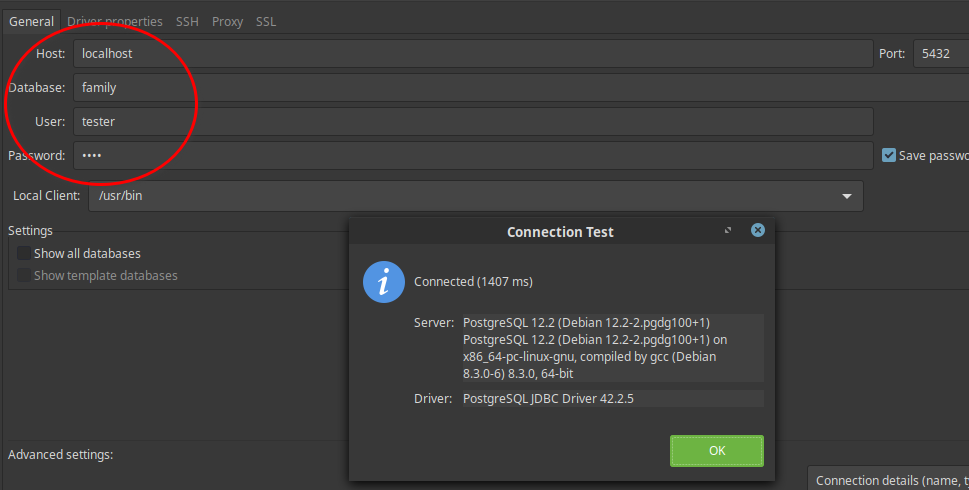
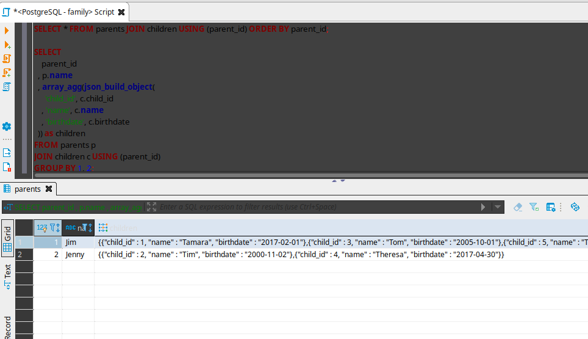

You have succeeded in [setting up docker engine in Fedora 32 and installing docker compose as well](/blog/set-up-docker-in-fedora-32/).

Now it is time to install postgresql as a docker container.

But first things first, Why install postgresql as a docker container rather than the usual [popular](https://computingforgeeks.com/how-to-install-postgresql-12-on-fedora/) way?

### Reasons for containerization of applications/databases.

1. Software installation is quite chaotic especially if you have various versions running in your system.
version clashes, upgrades and alot of productive time lost in this mundane task.
2. Container images launches faster as compared to applications installed directly in your Operating System
3. In this age of DevOps Culture,a methodology defined by high levels of interactivity between various 
stakeholders(DevOps Engineers, QA Automation Engineers and of, course Developers),the abstraction actually enhances the flexibility, portability and hence the agility of these teams in terms of delivery.
4. From a personal experience, this containerization has actually helped me alot when dealing with my highly partitioned OS, prior to that some of them e.g postgresql and plant-uml server were quite hard when configuring them.

Enough of that.Not convinced? Anyway, here is the process of setting up postgres as a docker container.

### Step 1: Create a Docker Compose file and run it

Ensure the docker service is running, trigger this manually.

```bash
$ sudo systemctl start docker
```

#### 1.1 Create a Docker Compose file

Here is your docker compose file configured with latest postgres
The `docker-compose.yml` file
```yml
version: "3.3"
services:
  database:
    image: postgres:latest # use latest official image
    env_file:
      - database.env # configure postgres
    volumes:
      - database-data:/var/lib/postgresql/data/ # persist data even if container shuts down
    ports:
      - 5432:5432
volumes:
  database-data: # names volumes can be managed easier using docker-compose

```
#### 1.2 Create an environment variable file

Now `database.env` file
```
POSTGRES_USER=tester
POSTGRES_PASSWORD=test
POSTGRES_DB=family
```
Type the following command to run postgres docker container.Make sure the above files are in the same directory
and the terminal is also pointing there before executing the following command.

```bash
$ docker-compose up 

```

Expected output from terminal logs

```bash
database_1  | 2020-05-15 18:03:32.502 UTC [1] LOG:  starting PostgreSQL 12.2 (Debian 12.2-2.pgdg100+1) on x86_64-pc-linux-gnu, compiled by gcc (Debian 8.3.0-6) 8.3.0, 64-bit
database_1  | 2020-05-15 18:03:32.503 UTC [1] LOG:  listening on IPv4 address "0.0.0.0", port 5432
database_1  | 2020-05-15 18:03:32.503 UTC [1] LOG:  listening on IPv6 address "::", port 5432
database_1  | 2020-05-15 18:03:32.568 UTC [1] LOG:  listening on Unix socket "/var/run/postgresql/.s.PGSQL.5432"
database_1  | 2020-05-15 18:03:32.749 UTC [25] LOG:  database system was shut down at 2020-05-15 18:03:24 UTC
database_1  | 2020-05-15 18:03:32.839 UTC [1] LOG:  database system is ready to accept connections

```
We are interested in this part `database system is ready to accept connections`

### Step 2: Connect your running container with you database client

In my case,I usually use [DBeaver](https://dbeaver.io/), you can use pgAdmin or [Adminer Client](https://www.adminer.org/).

**TODO:** Actually you can use a docker container for the client e.g [Adminer Docker Image](https://hub.docker.com/_/adminer/) but that is for another day.




### Step 3: Create tables in your database and add some data

Right click `PostgreSQL - family > SQL Editor` .Paste and execute the following sql scripts.

#### 3.1 Create tables
```sql
DROP TABLE IF EXISTS parents CASCADE;
CREATE TABLE parents (
  parent_id INTEGER PRIMARY KEY,
  name VARCHAR
);

DROP TABLE IF EXISTS children;
CREATE TABLE children (
  child_id INTEGER PRIMARY KEY,
  name VARCHAR,
  birthdate DATE,
  parent_id INTEGER,
  FOREIGN KEY (parent_id) REFERENCES parents
);
```

#### 3.2 Insert sample data
```sql

INSERT INTO parents VALUES
    (1, 'Jim')
  , (2, 'Jenny')
  ;

INSERT INTO children VALUES
    (1, 'Tamara', '2017-02-01', 1)
  , (2, 'Tim', '2000-11-02', 2)
  , (3, 'Tom', '2005-10-01', 1)
  , (4, 'Theresa', '2017-04-30', 2)
  , (5, 'Tonja', '2011-07-17', 1)
  ;

```

#### 3.3 Do some queries
```sql
SELECT * FROM parents JOIN children USING (parent_id) ORDER BY parent_id;
```
```sql
SELECT
    parent_id
  , p.name
  , array_agg(json_build_object(
      'child_id', c.child_id
    , 'name', c.name
    , 'birthdate', c.birthdate
  )) as children
FROM parents p
JOIN children c USING (parent_id)
GROUP BY 1, 2;
```

After closing our database client and stopping the container, we should later confirm if indeed our data was persisted.

### Conclusion
You have achieved the following:
1. Created a Docker Compose file and an environment file as well, the run it.
2. Connected your running container with your database client.
3. Created tables in your database and added some data.

Having done that now we have chance to look into [automating](/blog/automatically-start-docker-containers/) starting of some specific docker containers at system boot.


### Troubleshooting
Sometimes you may find out that you did something to your database and can't seem to fix it.You just wish to nuke everything and start on a clean
slate.So it would be better to completely delete the **docker volumes** holding the databases and recreating them afresh.

Here are steps you can follow:

#### 1. Delete all the containers
This is done prior to deleting the volumes.
```bash
$ docker rm $(docker ps -a -q) -f
```
If it is running you can either stop it or forcefully delete it using the following command
```bash
$ docker rm --force <container_id>
```

`container_id`, you will get it from the first command.

####  2. Delete all the volumes
```bash
$ docker volume prune
```
or be more specific if you don't want to delete all the volumes
```bash
$ docker volume ls
```
```bash
$ docker volume rm <volume_name>
```
#### 3. Recreate the volumes
Recreating is simply starting the application
```bash
$ docker-compose up build
```

If using **docker-compose.yml**, you may as well recreate the database.

```bash
$ docker-compose up -d --force-recreate database
```
The name `database` is actually one of our service in the docker-compose file(just look at it closely).

But before executing the above command you may need to check your environment variables.I had actually messed up on this one.

```bash
$ docker-compose exec database env
```
You can try connecting to server using following command, verify the role `tester` here is actually the one appearing in the output of above command.
```bash
$ docker-compose exec database  psql -U tester
```
If you need to kill the container `docker-compose kill`, then `docker-compose rm` to remove it.

Sometimes removing the images, containers etc, works so `docker-compose down`.

### References
- [Getting Started with PostgreSQL using Docker-Compose](https://medium.com/analytics-vidhya/getting-started-with-postgresql-using-docker-compose-34d6b808c47c)


Image by <a href="https://pixabay.com/users/vinsky2002-1151065/?utm_source=link-attribution&amp;utm_medium=referral&amp;utm_campaign=image&amp;utm_content=5099739">Vinson Tan ( 楊 祖 武 )</a> from <a href="https://pixabay.com/?utm_source=link-attribution&amp;utm_medium=referral&amp;utm_campaign=image&amp;utm_content=5099739">Pixabay</a>