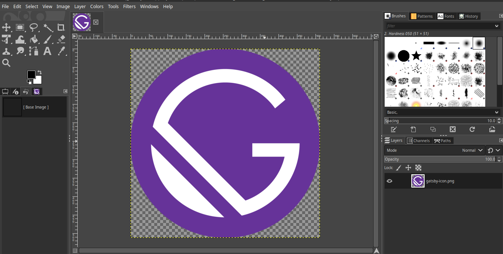
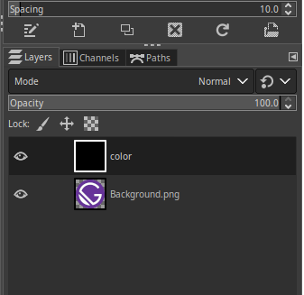
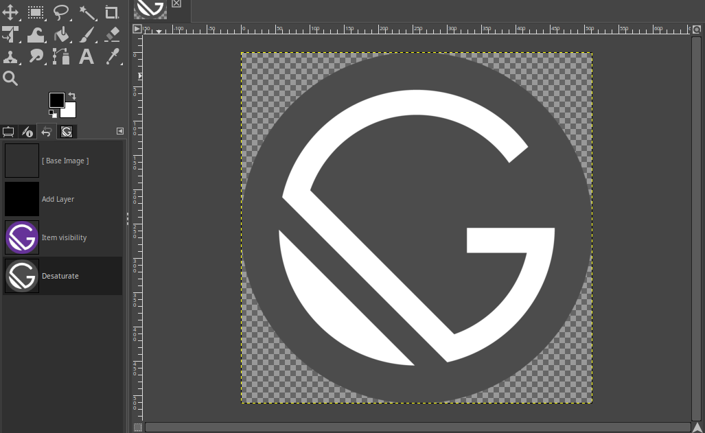
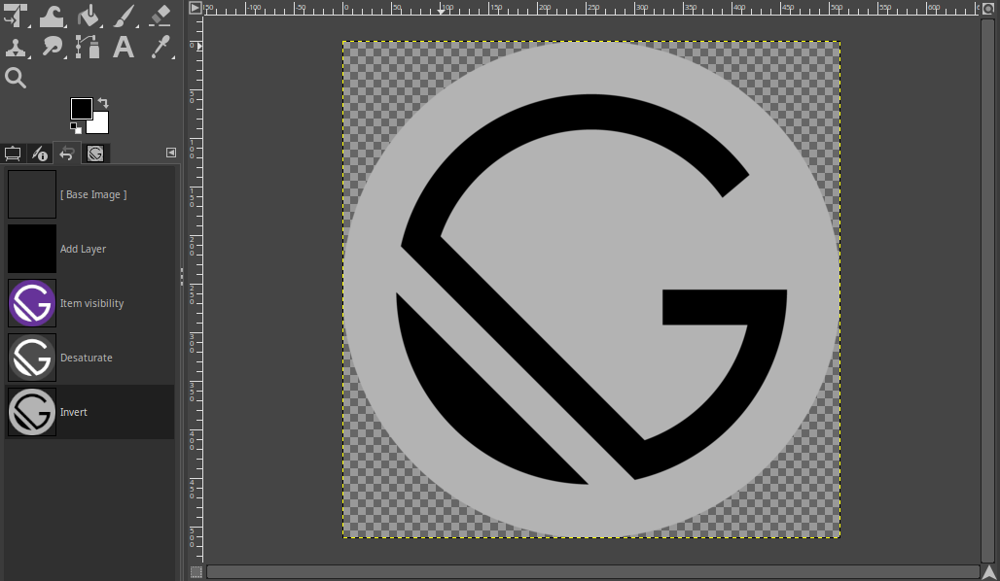
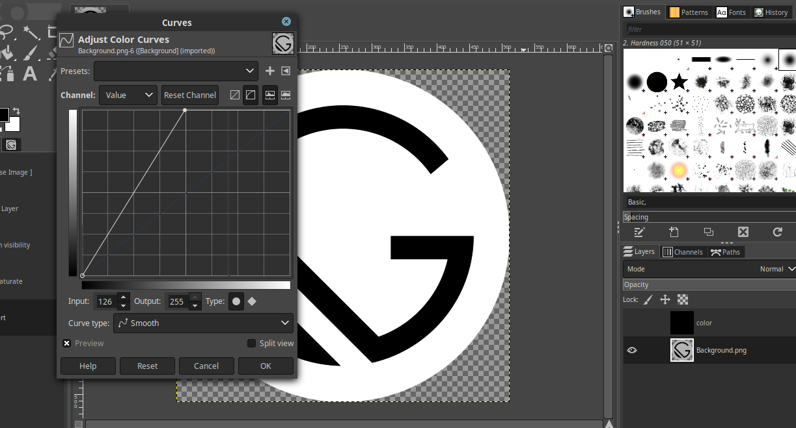
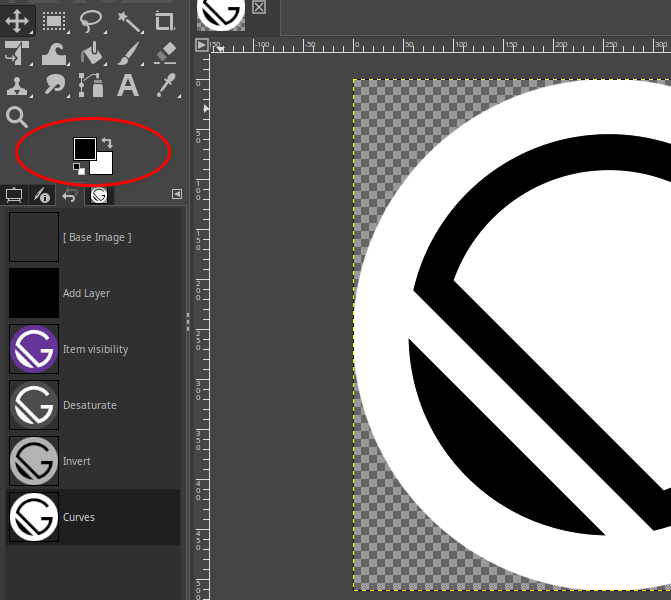
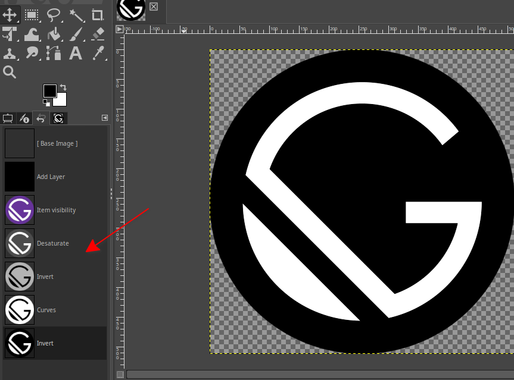

The theme of this blog is black and white.So I wanted all images and icons appearing here to match as well.

Some of the images(most of them) like the preview image here and also the `gimp` black and white were easier to find online.
The challenge here was for the ones I couldn't find!So I figured out an easier way around this.Of course using gimp.
Free and easier to use image editing software.

Am using fedora,operating system.Since it comes with fedora distribution.The installation is as easy as:

```
$ sudo dnf install gimp
```
Find an original icon;i mean the free ones or you can buy still.Check License.Then convert it to black and white.

## Here is Gatsby Icon


We want the icon to look like the one below.


### Step 1: Open the image in Gimp
Here is how it looks like in Gimp



### Step 2: Add an new Layer 
Add a new layer to the image by selecting `Layer > New Layer`.Call it `color`.Fill this layer with the `Black` color.The color we want to change our icon to.
In my case,it is the `Foreground Color`,so I choose Foreground color.
Make sure it's on top of the `Background` layer
as shown below.



Hide this new layer so we can work on the `Background` layer by clicking on the *eye button* just to the left of the layer thumbnail.

### Step 3: Manipulate the colors

Select the `Background` layer.Desaturate the image by selecting `Colors > Desaturate`.Choose `Lightness` for the dialog that pops up.

Your image should look `greyish` like below image.



Now, invert the image by selecting `Colors > Invert`



#### Step 4: Adjust Curves

Since in my case,I know my  `Background Color` is `white`.I can adjust the curves as shown below.
And get the below image.

To adjust the curves select `Colors > Curves`.



Foreground and Background colors are always displayed in gimp as shown below



#### Step 5: Flip Black and White Color

Now Select `Colors > Invert` to flip the black and white color.

You should see the resultant image below



The `red` arrow in the screenshot shows your steps in summary.

Voila! You are done.

#### 6: Export your new icon

You can export your visible icon by Selecting `File > Export as ...`

Give it a new name so that you don't overwrite the original one in case you missed a step and need to follow the process again.

### Reference

The web [article](http://www.benramey.com/2012/03/15/change-the-color-of-an-icon-with-gimp/) describing the process much better.
