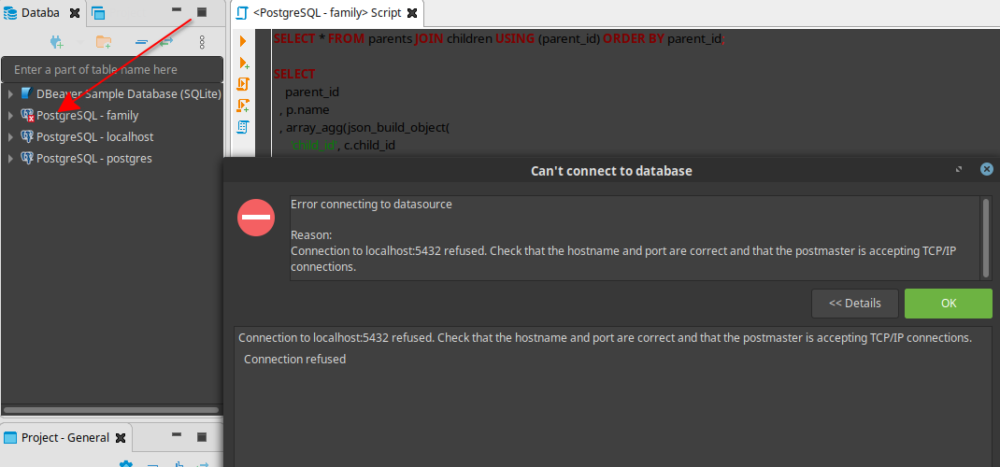

Recap from our last [post](/blog/docker-postgresql/), if you open up you database client, DBeaver for instance. You will get the following error.



Simply because we have not started docker-compose service hence the postgres container is not up and running.

You may want to start some of your containers at system boot.These are some of the applications that you use frequently and therefore you wish that everytime you are interacting with them, they are up and running!

### Containers you may wish to start automatically

1. [PlantUML Server](https://hub.docker.com/r/plantuml/plantuml-server/)

Docker server container to render [code as diagrams](https://real-world-plantuml.com/) or is it vice versa! (Diagrams as Code)

Check the references at the bottom of this post if you want to delve deeper into this subject.

2. [PostgreSQL](https://hub.docker.com/_/postgres/)
3. [GatsbyJS](https://hub.docker.com/r/gatsbyjs/gatsby/)

I will use [systemd](https://freedesktop/wiki/software/systemd), process manager to automate this.

### Step 1: Enable the Docker Service

```bash
$ sudo systemctl enable docker
```
Then confirm it is up and running `sudo systemctl status docker`

### Step 2: Create the Docker Compose Service File For Our Container
Change directory to the one shown below
```
$ cd /etc/systemd/system/
```
While inside that folder create a file. Mine I called it `docker-compose-familyDB.service`
Here is the command
```bash
$ sudo touch docker-compose-familyDB.service
```
Use vim or Gedit to open that file.
```bash
$ sudo gedit docker-compose-familyDB.service
```
Then paste the following content and save the file.

```
# /etc/systemd/system/docker-compose-familyDB.service

[Unit]
Description=Docker Compose Application familyDB  Service
Requires=docker.service
After=docker.service

[Service]
WorkingDirectory=/home/josphat/Desktop/docker-postgres
ExecStart=/usr/local/bin/docker-compose up
ExecStop=/usr/local/bin/docker-compose down
TimeoutStartSec=0
Restart=on-failure
StartLimitIntervalSec=60
StartLimitBurst=3

[Install]
WantedBy=multi-user.target
```
Check that the `WorkingDirectory` path is pointing to the location of your `docker-compose.yml` file. 
On our `docker-compose.yml` file, in the previous post, add the line `restart: always` meaning our container 
restarts only when Docker daemon restarts.Here is how our file now looks like.

```
version: "3.3"
services:
  database:
    image: postgres:latest # use latest official image
    env_file:
      - database.env # configure postgres
    volumes:
      - database-data:/var/lib/postgresql/data/ # persist data even if cotainer shuts down
    ports:
      - 5432:5432
    restart: always
volumes:
  database-data: # names volumes can be managed easier using docker-compose

```

### Step 3: Activate the Service File
First reload the unit file we created.Run this command everytime you do a modification to your unit file.

```
$ sudo systemctl daemon-reload
```

Then activate the service run by typing the following commands

```
$ sudo systemctl enable docker-compose-familyDB.service
```
Whenever you want to stop the service, here are the commands

```
$ sudo systemctl stop docker-compose-familyDB.service
$ sudo systemctl disable docker-compose-familyDB.service

```
### Step 4: Verify your Service is Running

Reboot
```bash
$ reboot
```
Then after you system is up, Open Dbeaver Client and Verify if the **Database Connection Error** is displayed, as shown by the screenshot on the top of this post.

If you were able to connect to your database automatically, then your service is up and running, in short, you have automatically started postgres docker container at system reboot. Otherwise you can type the following command to check status of your service and troubleshoot as necessary.

```
$ sudo systemctl status docker-compose-familyDB.service
```

### TODO:
I will definately remove these references from this post and create another post for Diagram As Code.

### References
Although this article is about autostarting docker container, I thought I should list some important reference here for someone who may wish to pursue diagram as code topic later.

If you wish to learn more on this Diagram As Code.Here are a few resources,I found online.

- [How to edit Markdown and UML in Visual Studio Code](https://www.freecodecamp.org/news/inserting-uml-in-markdown-using-vscode/)
- [Create Cloud-Based Diagrams with Python](https://diagrams.mingrammer.com/)
- [Still More Plant UML Diagrams](https://ogom.github.io/draw_uml/plantuml/)
- [Everything As Code!](https://hackernoon.com/everything-as-code-explained-0ibg32a3)
