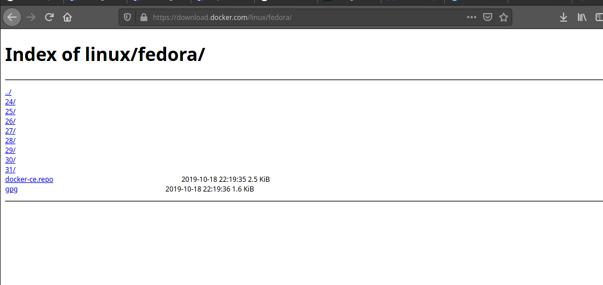

This post seems trivial especially to the geeks out there.There are tonnes of links for this!

The official one [Install Docker Engine on Fedora](https://docs.docker.com/engine/install/fedora/) has precisely all the steps that you we need to get going.

The post is for **Fedora 32** but as of today(see blog post date).It is not possible to do that by following
the above link.The link rather showed the requirements for Fedora 30 and 31  but if you are like me.Always 
want to try out the new release(Fedora 32).You will find yourself facing installation errors if you upgraded
your fedora.

## Problem
How do I get my Fedora 32 to work with docker nonetheless?

### Solution
So if you type
```bash
$ sudo dnf install docker-ce docker-ce-cli containerd.io
```
you will definately get errors as explained above.Simply because the latest repo as of today May 15, 2020 
is for Fedora 31.

If you look closely at this screenshot, you can confirm that.

 Number 32 for Fedora 32 is missing!

### Step 1: Delete the created local repository file for Docker CE 31
Open your terminal and type enter `cd /etc/yum.repos.d/`.The type `ls` to list files there.

You realize that a repo file for docker was created though our installation was unsuccessful.

Just remove it `sudo rm  <the-docker-filename>.repo`.Type `ls` to confirm it is no longer there.

### Step 2: Create a new custom local repository file for Docker CE 31
We will name our file `docker-ce-31.repo`.For obvious reasons, it belongs to fedora 31 till the time they update
there directory listings.

While terminal is still in that folder.Type `sudo touch docker-ce-31.repo` to create file.

The type `sudo gedit docker-ce-31.repo` or you can use vim to open the file.

Copy - Paste the following contents.
```bash
[docker-ce-31]
name=Docker CE stable 31
baseurl=https://download.docker.com/linux/fedora/31/x86_64/stable
enabled=1
```
Then Save.

### Step 3: Configure your system so that it can recognize this repos and use it to install and update docker
Don't forget we will be using docker repository for fedora 31.

Type the command below.Kindly confirm your terminal is in this folder `yum.repos.d`.

```bash
$ sudo dnf config-manager --add-repo=docker-ce-31.repo
```
If still encountering issues with above command try
```bash
 $ sudo dnf config-manager --add-repo=https://download.docker.com/linux/fedora/31/x86_64/stable
```
To test that the above command added the repos successfully and its working type.

```bash
$ sudo dnf update
```
to up date your system.

### Step 4: Install the docker engine
Now install the docker engine
Type
```bash
$ sudo dnf install docker-ce docker-ce-cli containerd.io
```

You can type ` $ docker --version` to confirm the installation.

## Bonus
### Setup Docker-Compose
The commands in order are:

1. Download current stable release using curl
```bash
$ sudo curl -L "https://github.com/docker/compose/releases/download/1.25.5/docker-compose-$(uname -s)-$(uname -m)" -o /usr/local/bin/docker-compose
```
2.  Make the binary executable
```bash
$ sudo chmod +x /usr/local/bin/docker-compose
```
3. Add a symbolic link
```bash
$ sudo ln -s /usr/local/bin/docker-compose /usr/bin/docker-compose
```

4. Test the installation
```bash
$ docker-compose --version
```


Image by <a href="https://pixabay.com/users/AnnaliseArt-7089643/?utm_source=link-attribution&amp;utm_medium=referral&amp;utm_campaign=image&amp;utm_content=5112223">Annalise Batista</a> from <a href="https://pixabay.com/?utm_source=link-attribution&amp;utm_medium=referral&amp;utm_campaign=image&amp;utm_content=5112223">Pixabay</a>
